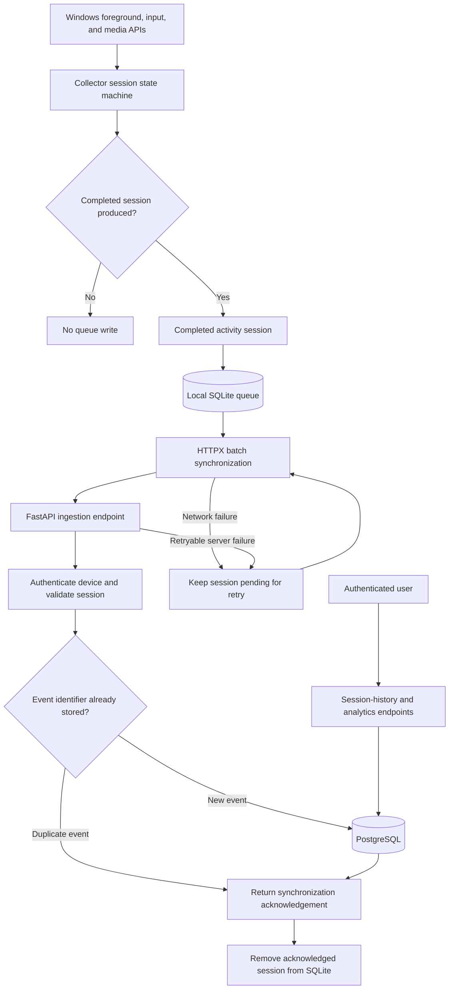

# LeapScope Product Contract

## Phase 1 User Workflow

1. The user starts the LeapScope backend and Windows collector.
2. The user registers an account through the API.
3. The user logs in and receives an access token.
4. The user registers the current computer as a collector device.
5. LeapScope generates a separate revocable device token.
6. The user places the device token in the collector configuration.
7. The user configures the idle threshold and optional application exclusions.
8. The user starts the collector and uses the computer normally.
9. The collector automatically detects foreground application changes and idle time.
10. Completed activity sessions are saved to the local SQLite queue.
11. The collector periodically synchronizes queued sessions with the backend.
12. The backend validates and stores sessions without accepting duplicates.
13. The user requests session history through the API.
14. The user requests daily application totals through the API.
15. The user can revoke a collector device, preventing further synchronization.

## Offline Workflow

1. The backend becomes temporarily unavailable.
2. The collector continues recording completed sessions locally.
3. Failed uploads remain pending in the SQLite queue.
4. The collector retries synchronization later.
5. The backend recognizes already accepted event identifiers.
6. No session is lost or stored twice.

## Phase 1 Interface

Phase 1 is operated through the FastAPI API and Swagger UI. The graphical dashboard
will be implemented in a later phase.

## Activity Session Definition

An activity session is a continuous period during which:

- one trackable application is the active foreground application;
- the user is considered active rather than idle;
- the collector is running and activity tracking is enabled.

A session represents foreground attention, not every process running on the computer.

LeapScope does not count:

- background applications;
- minimized applications;
- background downloads or updates;
- time recorded while the user is idle;
- applications excluded by the user;
- time recorded while tracking is paused.

Phase 1 stores the application identity and session timestamps. It does not record keystrokes, screenshots, document contents, or complete window titles.

## Idle And Media Activity

By default, the user enters an idle state when:
- No mouse or keyboard input has been detected for 5 minutes

A user is considered active when either:

- Windows has received keyboard or mouse input within the idle threshold; or
- the foreground application has a verified active media session.

Media playback prevents idle status only when:

- playback is currently running rather than paused;
- the media belongs to the foreground application;
- Windows is not locked, sleeping, or shutting down.

Simply belonging to a media category does not exempt an application from idle detection. For example, leaving a paused YouTube tab open must not produce activity time.

Background media does not replace foreground tracking. If YouTube is playing in the background while VS Code is being used, LeapScope records VS Code as the foreground application.

When playback stops, normal input-based idle detection resumes. Locking Windows or entering sleep mode ends the current session regardless of media playback.

## Multiple-Window Behavior

LeapScope records at most one foreground application at a time.

- Visible but unfocused windows are not recorded separately.
- Multiple monitors follow the same foreground-window rule.
- Switching between different applications ends the current session and starts another.
- Switching between two windows belonging to the same application does not create a new application session.
- Background media playback does not create a simultaneous session.

## Activity Session Lifecycle

### A Session Starts When

A new activity session starts when:

- the collector starts while a trackable application is in the foreground and the user is active or verified foreground media is playing;
- the user switches from one trackable application to another;
- the user returns from an idle state;
- tracking resumes after being paused;
- the user returns from an excluded application to a trackable application;
- verified media playback begins in the foreground application while the user would otherwise be idle.

A session starts at the moment the collector observes the qualifying event. LeapScope does not assign activity time from before the collector was running.

### A Session Finishes When

The current activity session finishes when:

- another application becomes the foreground application;
- the five-minute idle threshold is reached;
- the foreground application closes;
- the foreground application becomes excluded;
- the user pauses activity tracking;
- Windows is locked, enters sleep mode, signs out, or shuts down;
- the collector shuts down normally;
- foreground media playback stops while the user has already exceeded the idle threshold.

### Boundary Rules

- Switching applications finishes the previous session and starts the next session at the same timestamp.
- Reaching the idle threshold ends the session at `last input time + idle threshold`.
- Returning from idle starts a new session rather than continuing the previous one.
- Switching between windows belonging to the same application continues the existing session.
- Opening an excluded or untrackable application ends the current session without starting another.
- An unexpected collector failure must not generate activity beyond its last reliable observation.
- Sessions must have an ending timestamp later than their starting timestamp.
- Sessions belonging to the same collector device must never overlap.

## Application Information Storage

LeapScope stores only the application information required to identify applications and produce usage analytics.

### Permanently Stored Application Information

The backend may store:

- an internal application identifier;
- the normalized executable name, such as `Code.exe`;
- a readable application name, such as `Visual Studio Code`;
- an optional software publisher or Windows package identifier;
- a user-defined application alias;
- a user-defined category;
- when the application was first and most recently detected.

Publisher or package information may be used to distinguish applications that have identical executable names.

### Permanently Stored Session Information

Each synchronized activity session may contain:

- a unique collector event identifier;
- the owning user and collector device identifiers;
- the identified application;
- the UTC starting timestamp;
- the UTC ending timestamp;
- synchronization and creation timestamps.

Session duration is calculated from the starting and ending timestamps.

### Temporarily Observed Information

The collector may temporarily inspect the following information while determining activity:

- process identifier;
- foreground-window handle;
- last keyboard or mouse input time;
- whether foreground media is currently playing.

This information is used locally and is not permanently stored unless required by a later, documented feature.

### Information Not Stored

Phase 1 does not store:

- complete window titles;
- document or project names;
- complete executable paths;
- process command-line arguments;
- visited URLs or browser history;
- browser-tab contents;
- video, stream, or song titles;
- keystrokes or mouse movements;
- clipboard contents;
- screenshots or screen recordings;
- contents of files, messages, or forms.

Browsers are treated as applications during Phase 1. LeapScope records browser usage but does not identify individual websites or tabs.

## Application Exclusion And Privacy Rules

### Tracking Control

- Activity tracking begins only after the user starts and configures the collector.
- The user may pause and resume all tracking.
- Pausing tracking immediately finishes the current session.
- Resuming tracking starts a new session only if a trackable foreground application exists and the user is active or verified foreground media is playing.
- LeapScope must not operate as hidden employee, household, or third-party monitoring software.

### Application Exclusions

Applications are tracked by default unless they are excluded by the user or by a built-in system rule.

When an excluded application becomes the foreground application:

- the current tracked session finishes;
- no session is created for the excluded application;
- no usage timestamps or duration are placed in the local SQLite queue;
- no activity for that application is transmitted to the backend;
- verified media playback does not override the exclusion.

When the user returns to a trackable application, a new session begins.

Exclusions are enforced by the collector before session persistence or synchronization. The backend must not receive activity sessions and discard them afterward.

### Exclusion Configuration

- During Phase 1, exclusions are configured and stored locally on each collector device.
- Synchronizing exclusions between registered devices is planned for a later phase.
- An exclusion rule may store enough application identity to recognize the excluded application.
- Storing an exclusion rule does not permit storing usage history for that application.
- During Phase 1, browsers can only be excluded as complete applications, not by individual website.

LeapScope itself and Windows lock or sign-in surfaces are excluded automatically.

### Historical Data

Excluding an application affects future collection. It does not silently delete activity that was recorded before the exclusion.

Historical data remains until the user explicitly deletes it through a future data-management feature.

### Privacy Guarantees

LeapScope must not:

- record activity before the collector is deliberately started;
- create sessions while tracking is paused;
- upload sessions belonging to excluded applications;
- inspect excluded applications for media activity;
- log authentication tokens, passwords, or private application content;
- expose one user's activity to another user;
- use collected activity for advertising or third-party profiling.

The local SQLite queue contains only sessions awaiting synchronization. Successfully accepted sessions are removed from the queue after confirmation from the backend.

## Collector-To-Database Data Flow



## Flow Rules

1. Windows activity is observed locally by the collector.
2. Privacy and exclusion rules are applied before creating a session.
3. Completed sessions are written to SQLite before any upload attempt.
4. The collector sends queued sessions to FastAPI in batches.
5. FastAPI authenticates the collector device and validates session ownership and timestamps.
6. PostgreSQL stores only events whose identifiers have not already been accepted.
7. Duplicate events are acknowledged without creating duplicate rows.
8. The collector removes only sessions confirmed by the backend.
9. Failed uploads remain in SQLite and are retried later.
10. Users access stored sessions and analytics through FastAPI, never by connecting directly to PostgreSQL.

## UTC Storage And Reporting Timezone

### Timestamp Storage

- The collector records session start and end times as timezone-aware UTC timestamps.
- The local SQLite queue stores timestamps in ISO 8601 UTC format.
- The collector sends UTC timestamps to the API.
- PostgreSQL stores session timestamps using timezone-aware columns.
- The backend rejects timestamps that do not contain timezone information.
- Session duration is calculated from the UTC start and end timestamps.
- Changing a user's timezone never changes the timestamps stored for existing sessions.

Example UTC timestamp:

```text
2026-08-22T08:30:00Z
```

### User Reporting Timezone

- Every user has one reporting timezone.
- The timezone is stored using an IANA timezone name, such as `Europe/Warsaw`, rather than a fixed offset such as `UTC+1`.
- New users default to `UTC` until another reporting timezone is configured.
- Raw session-history timestamps are returned in UTC.
- Daily and other calendar-based analytics use the user's reporting timezone.
- Changing the reporting timezone may change which local day contains an existing session, but it does not modify the stored session.

IANA timezone names are used because they account for daylight-saving-time changes.

### Calendar Boundaries

- Daily analytics represent local calendar days in the user's reporting timezone.
- The backend converts the beginning and end of the requested local day into UTC before querying PostgreSQL.
- A session crossing local midnight contributes time to both affected days.
- Daylight-saving transitions are handled using timezone-aware boundaries; LeapScope must not assume every local day contains exactly 24 hours.

### Example

```text
Session in Europe/Warsaw:
23:50-00:10

Daily allocation:
Previous day: 10 minutes
Next day:     10 minutes
```
